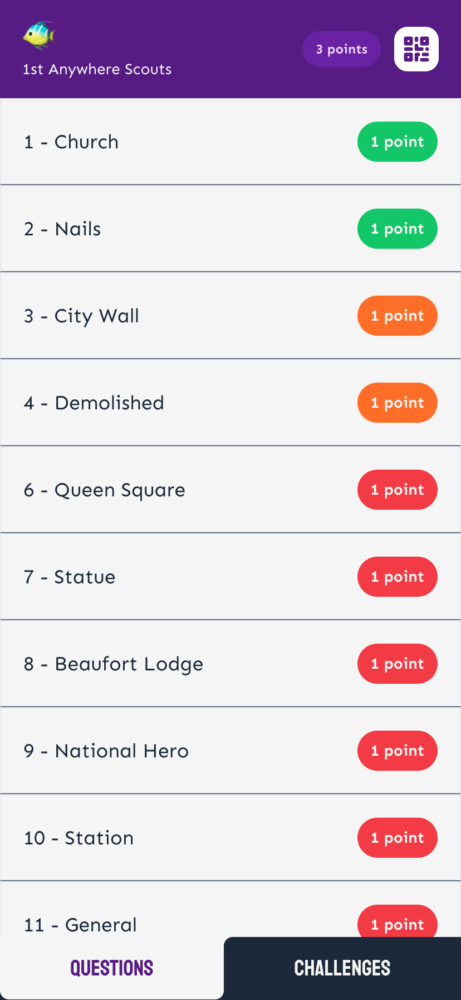
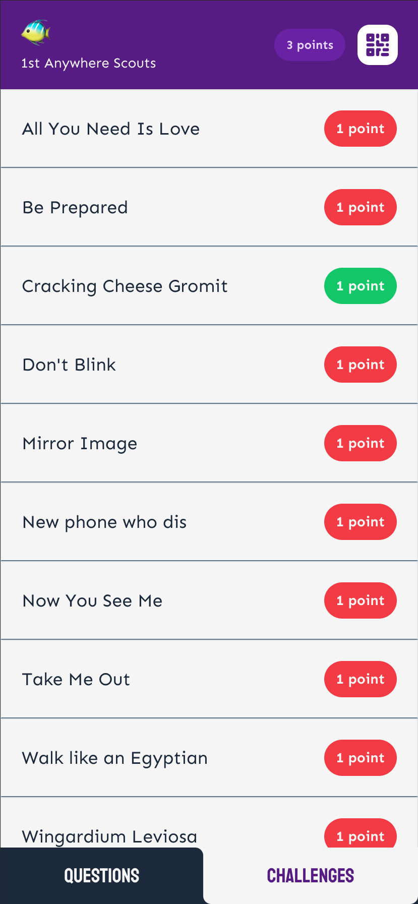
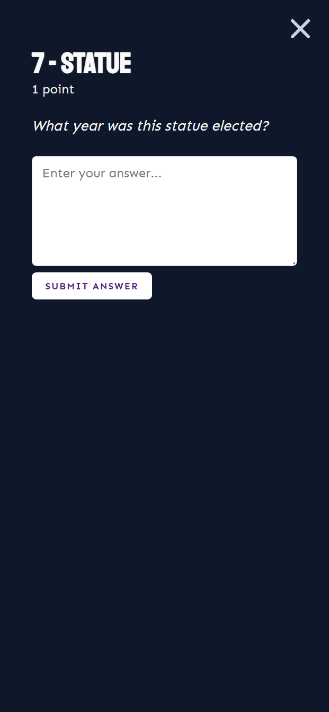
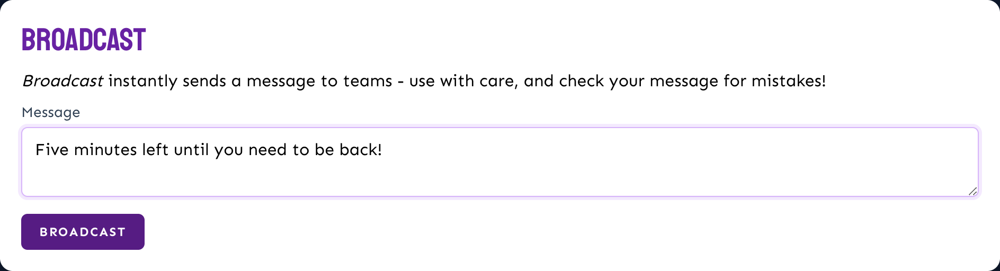
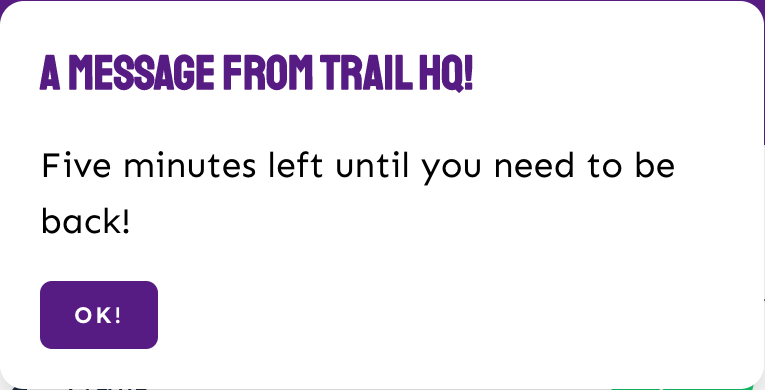
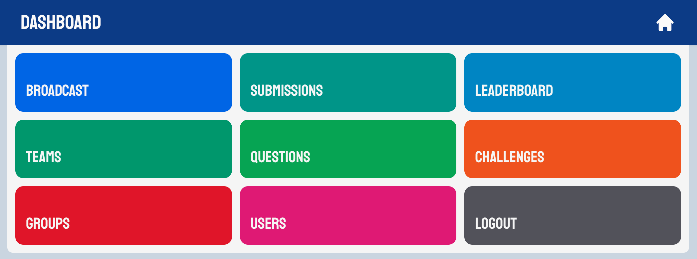

# TrailApp
A web app to run wide game/challenge trail/scavenger hunt type events featuring questions and photo challenges.

[Jump to installation instructions](#getting-started)

## Answer questions and complete challenges
Submit answers & photos directly from the app

|  |  |
| --- | --- |
|  |  |

## Realtime feedback on submissions
Control team able to accept or reject submissions that have been sent in - feedback given to teams in realtime and points/leaderboard automatically updated.

|  |  |
| --- | --- |

## Realtime messaging from control to teams
Ability to broadcast messages out to teams (both to individual teams, and to all teams).

|  |  |
| --- | --- |

## Supports multiple teams members working collaboratively
QR code allows other members to join the team on the app and be submitting at the same time - realtime feedback to teams throughout the event keeps all members in sync as they go.

## Simple dashboard interface
Setup your relevant users and groups, add questions and challenges, mark submissions as they come in, broadcast messages to teams.

# Getting Started
Want to jump straight into testing the app? Try running *quickstart*:

- [Check prerequisites are installed](#prerequisites)
- Clone the repository: `git clone https://github.com/CabotExplorers/trailapp.git`
- Run *quickstart*: `./trail quickstart`
- [Open the app in your browser](http://127.0.0.1:8000/login) and login with username `root`, password `password`.

## Custom installation
- Clone the repository: `git clone https://github.com/CabotExplorers/trailapp.git`
- Generate initial environment variables file: `./trail init`
- [Fill out environment variables depending on your setup](#environment-variables)
- [Setup your container ingress method](#ingress-methods)
- Build app: `./trail build all`
- Run database migrations: `./trail migrate`
- Create an initial user: `./trail add-user`
- Login to the dashboard and add your groups, questions, challenges, and other users.
- Start your trail!

### Prerequisites
The app makes use of containers to minimise the need for installing/configuring software, but still requires some essentials to get to that stage:

- Linux (either native or using Windows Subsystem for Linux) or macOS
- [git](https://github.com/git-guides/install-git) - for cloning this repository (comes with most Distros already)
- [docker](https://docs.docker.com/engine/install/) - for running containers
- [openssl](https://www.openssl.org/) - for generating random strings (comes with most Distros already)

### Ingress Methods
To run the trail you need to get connections into the core app container and the websockets container (unless you really don't want any of the real time stuff).

There's a whole host of proxy services you can use:
- [Nginx Proxy Manager](https://nginxproxymanager.com/)
- [HAProxy](http://www.haproxy.org/)
- [Cloudflare tunnels](https://www.cloudflare.com/en-gb/products/tunnel/) probably? Not sure how this handles websocket traffic

Use the `APP_PORT` and `APP_WEBSOCKET_PORT` environment vars to set which ports you want the containers to listen on, then point your connections there. Don't forget to update the `APP_HOST` and `APP_WEBSOCKET_HOST` vars to the *external addresses* your proxy is listening.

#### Traefik
If you're using the [Traefik](https://doc.traefik.io/traefik/) edge router then TrailApp comes with a docker compose stub and environment variables to configure this (because it's what we use on our server).

Variables to set:
| Variable | Value |
| --- | --- |
| `DOCKER_INGRESS` | "traefik" |
| `DOCKER_TRAEFIK_NETWORK` | the docker network your traefik container routes through (default: "traefik") |
| `APP_HOST` | the domain the main app container should be reachable at |
| `APP_WEBSOCKET_HOST` | the domain the websockets container should be reachable at |
| `APP_WEBSOCKET_PORT` | the port traefik is listening on for the websocket container, unless you've added extra entry points you probably want to use web secure (443) |

### Environment Variables
*insert table here*
